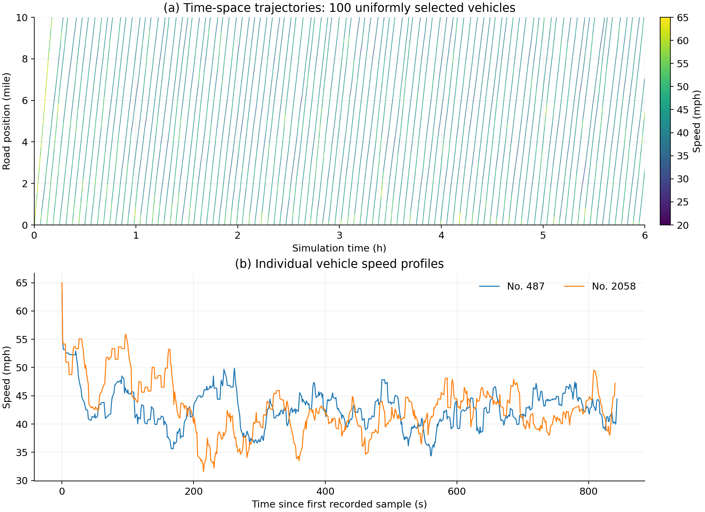
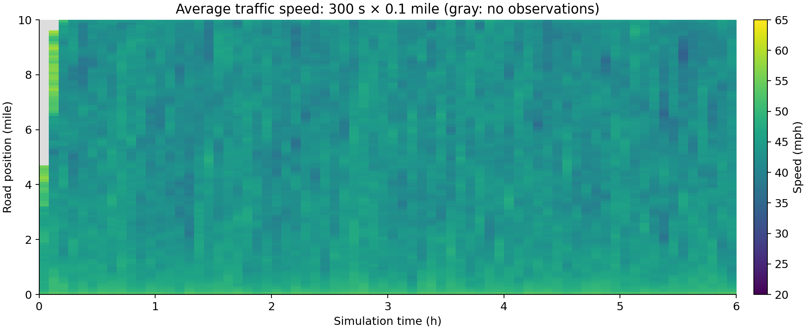

# SUMO trajectory dataset

A 10-mile, single-lane road without traffic signals; 6-hour simulation,
1-second trajectory sampling, random seed 42. Vehicle arrivals, preferred speeds
and following parameters are randomized; full settings are in `data/parameters.json`.
The dataset contains 3,597 vehicles and 2,950,938 trajectory records;
3,451 trips finished and 146 remained unfinished at the six-hour cutoff.

- `collect_sumo_dataset.py`: generate the scenario and collect trajectories.
- `plot_dataset.py`: reconstruct the traffic field and draw the two figures below.
- `data/`: raw trajectories, vehicle/demand summaries, parameters and traffic field.
- `figures/`: vehicle trajectory plots and the traffic-speed heatmap.

Use Python 3.9+ and SUMO 1.26.0. Set `SUMO_HOME` to the SUMO installation folder.

```sh
python -m pip install -r requirements.txt
python plot_dataset.py
```

To collect a new dataset (the output folder must be new or empty):

```sh
python collect_sumo_dataset.py --traffic-lights 0 --duration-hours 6 --road-miles 10 --seed 42 --output outputs/new_run
python plot_dataset.py --data outputs/new_run --figures outputs/new_run/figures
```

The traffic field uses 300-s × 0.1-mile cells: first average speeds within each
vehicle, then across vehicles. Empty cells are flagged, filled with 65 mph in the
CSV for compatibility, and shown in gray in the heatmap. The trajectory figure
shows 100 uniformly selected vehicle IDs and speed profiles of No. 487 and No. 2058.




For GitHub upload, install Git LFS and run `git lfs install` before `git add .`;
the supplied `.gitattributes` handles the 198 MB trajectory file. The collector's
README reference was updated during packaging; its simulation logic is unchanged.
